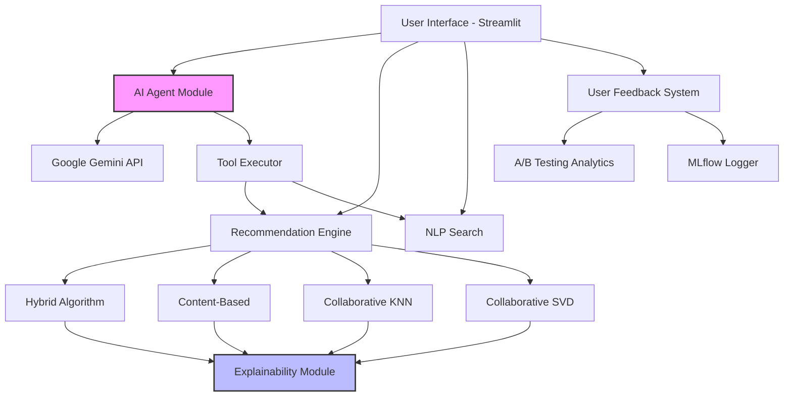

# 🎬 AI-Powered Movie Recommendation System

An intelligent movie recommendation engine featuring a **ReAct-based AI Agent**, hybrid filtering algorithms, explainable recommendations, and comprehensive A/B testing analytics.

[](https://www.python.org/downloads/)
[](https://streamlit.io/)
[](LICENSE)

---

## 🌟 Key Features

### 🤖 Agentic AI Assistant
- **ReAct Agent Architecture**: Autonomous tool-calling AI that decides when to search the database vs. use general knowledge
- **Natural Language Understanding**: Query optimization using Google Gemini to extract relevant keywords
- **Hybrid Knowledge**: Combines local movie database with LLM's general knowledge for comprehensive recommendations
- **Conversational Memory**: Maintains context across multi-turn conversations

### 🎯 Advanced Recommendation Algorithms
1. **Hybrid Recommendation**: Combines content-based and collaborative filtering for optimal results
2. **Content-Based Filtering**: TF-IDF vectorization on movie metadata (genres, cast, crew, keywords)
3. **Collaborative Filtering (KNN)**: User-item matrix with K-Nearest Neighbors
4. **Collaborative Filtering (SVD)**: Matrix factorization using Singular Value Decomposition

### 💡 Explainable AI
- **Why Recommended?**: Each recommendation includes top 3 reasons (shared genres, cast, themes)
- **Transparency**: Users understand the recommendation logic, building trust

### 📊 A/B Testing Dashboard
- **Real-time Analytics**: Compare algorithm performance based on user feedback
- **Statistical Insights**: Like/dislike rates, winner determination, method popularity
- **Data-Driven Decisions**: Identify which algorithm works best for your users

### 📈 MLflow Integration
- **Experiment Tracking**: Log recommendations, user ratings, and A/B test results
- **Performance Metrics**: Response time, recommendation count, rating distribution
- **Reproducibility**: Track model versions and parameters

### 🔍 NLP-Powered Search
- **Semantic Search**: TF-IDF-based keyword matching across movie metadata
- **Flexible Queries**: Search by director, actor, genre, theme, or plot keywords
- **Relevance Scoring**: Results ranked by cosine similarity

---

## 🏗️ Architecture



---

## 🚀 Quick Start

### Prerequisites
- Python 3.8+
- 2GB+ RAM (for loading models)
- Google Gemini API key (for AI Assistant)

### Installation

1. **Clone the repository**
```bash
git clone https://github.com/MuhammadAkmal03/Movie_Recommendation.git
cd Movie_Recommendation
```

2. **Create virtual environment**
```bash
python -m venv venv
source venv/bin/activate  # On Windows: venv\Scripts\activate
```

3. **Install dependencies**
```bash
pip install -r requirements.txt
```

4. **Set up environment variables**
```bash
cp .env.example .env
# Edit .env and add your GEMINI_API_KEY
```

5. **Generate model files**
```bash
python create_lite_models.py
```
> This will create ~2.5GB of model files. Ensure you have sufficient disk space.

6. **Initialize MLflow**
```bash
python initialize_mlflow.py
```

7. **Run the application**
```bash
streamlit run app.py
```

The app will open at `http://localhost:8501`

---

## 📖 Usage Guide

### 1️⃣ Movie-Based Recommendations
1. Select a movie you like from the dropdown
2. Choose a recommendation algorithm
3. Click "Get Recommendations"
4. Rate recommendations with 👍 or 👎

### 2️⃣ AI Assistant
1. Enter your Gemini API key (or set in `.env`)
2. Ask questions in natural language:
   - "Show me movies like Inception"
   - "What are the best sci-fi movies from 2023?"
   - "Recommend something funny but not stupid"
3. Use Quick Actions for common queries

### 3️⃣ NLP Search
1. Enter keywords (director, actor, genre, theme)
2. Click Search
3. Results ranked by relevance

### 4️⃣ A/B Testing Dashboard
- View algorithm performance comparison
- See which method users prefer
- Track total ratings and like rates

### 5️⃣ MLflow Metrics
1. Run `mlflow ui` in terminal
2. Visit `http://localhost:5000`
3. Explore logged experiments and metrics

---

## 🛠️ Tech Stack

| Component | Technology |
|-----------|-----------|
| **Frontend** | Streamlit |
| **AI Agent** | Google Gemini (gemini-1.5-flash) |
| **NLP** | Scikit-learn (TF-IDF, Cosine Similarity) |
| **Collaborative Filtering** | Scikit-learn (KNN, SVD) |
| **Experiment Tracking** | MLflow |
| **Data Processing** | Pandas, NumPy |
| **Visualization** | Matplotlib, Streamlit Charts |

---

## 📊 Dataset

- **Source**: TMDb (The Movie Database) / MovieLens
- **Size**: 45,000+ movies
- **Features**: Title, genres, cast, crew, keywords, overview, ratings, release date
- **Preprocessing**: TF-IDF vectorization, user-item matrix construction

---

## 🧠 How the AI Agent Works

The agent uses a **ReAct (Reasoning + Acting)** pattern:

1. **Understand**: Parses user query using Gemini
2. **Decide**: Determines if it needs to use tools (search database) or can answer directly
3. **Act**: Executes tools if needed:
   - `search_movies(query)` - Search local database
   - `get_recommendations(movie_title, method)` - Get similar movies
   - `get_movie_details(movie_title)` - Fetch movie info
4. **Respond**: Generates natural language response with results

**Example Flow:**
```
User: "I want to watch Nolan movies"
  ↓
Agent: Optimizes query → "Nolan"
  ↓
Agent: Calls search_movies("Nolan")
  ↓
Database: Returns ["Inception", "Interstellar", "Tenet"]
  ↓
Agent: Formats response naturally
```

---

## 📁 Project Structure

```
Movie_Recommendation/
├── app.py                      # Main Streamlit application
├── requirements.txt            # Python dependencies
├── .env.example               # Environment variables template
├── create_lite_models.py      # Model generation script
├── mlflow_config.py           # MLflow configuration
├── initialize_mlflow.py       # MLflow setup
│
├── src/
│   ├── agent/                 # AI Agent module
│   │   ├── movie_agent.py     # ReAct agent implementation
│   │   └── ui.py              # Agent UI components
│   │
│   ├── data/
│   │   └── loader.py          # Data loading utilities
│   │
│   ├── models/
│   │   └── recommender.py     # Recommendation algorithms
│   │
│   ├── utils/
│   │   ├── helpers.py         # Helper functions
│   │   ├── feedback.py        # User rating system
│   │   ├── ab_testing.py      # A/B testing analytics
│   │   ├── mlflow_logger.py   # MLflow logging
│   │   └── explainability.py  # Explanation generation
│   │
│   └── config.py              # Configuration settings
│
├── assets/
│   └── noimage.png            # Placeholder image
│
└── models_lite/               # Generated model files (not in git)
    ├── tfidf_matrix.pkl
    ├── knn_model.pkl
    ├── svd_similarity.pkl
    └── ...
```

---

## 🔧 Configuration

### Environment Variables (`.env`)
```bash
GEMINI_API_KEY=your_api_key_here
```

### Model Paths (`src/config.py`)
```python
MODELS_DIR = "models_lite"
TFIDF_MATRIX_PATH = os.path.join(MODELS_DIR, "tfidf_matrix.pkl")
# ... other paths
```

---

## 📈 Performance Metrics

| Algorithm | Avg. Response Time | Memory Usage |
|-----------|-------------------|--------------|
| Content-Based | ~200ms | ~500MB |
| KNN | ~300ms | ~800MB |
| SVD | ~150ms | ~600MB |
| Hybrid | ~250ms | ~900MB |

---

## 🚢 Deployment

### Option 1: Hugging Face Spaces (Recommended)
1. Create a new Space on Hugging Face
2. Upload all files except `models_lite/`
3. Users run `create_lite_models.py` on first launch
4. Set `GEMINI_API_KEY` in Space secrets

### Option 2: Google Cloud Run
1. Optimize models to reduce size
2. Create Dockerfile
3. Deploy to Cloud Run
4. Configure environment variables

See [deployment_guide_hf.md](deployment_guide_hf.md) for detailed instructions.

---

## 🤝 Contributing

Contributions are welcome! Please:
1. Fork the repository
2. Create a feature branch (`git checkout -b feature/AmazingFeature`)
3. Commit changes (`git commit -m 'Add AmazingFeature'`)
4. Push to branch (`git push origin feature/AmazingFeature`)
5. Open a Pull Request

---

## 📝 License

This project is licensed under the MIT License - see the [LICENSE](LICENSE) file for details.

---

## 🙏 Acknowledgments

- **TMDb** for the movie dataset
- **Google Gemini** for the AI capabilities
- **Streamlit** for the amazing framework
- **Scikit-learn** for ML algorithms
- **MLflow** for experiment tracking

---

## 📧 Contact

**Muhammad Akmal**
- GitHub: [@MuhammadAkmal03](https://github.com/MuhammadAkmal03)
- Project Link: [https://github.com/MuhammadAkmal03/Movie_Recommendation](https://github.com/MuhammadAkmal03/Movie_Recommendation)

---

---

<div align="center">
  
</div>
